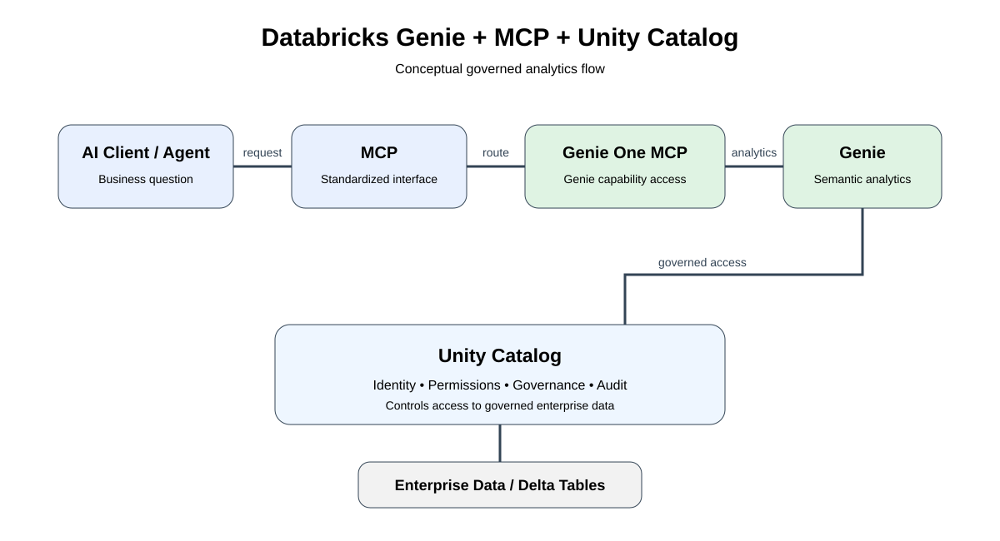

# Databricks Genie + MCP Lab

A hands-on learning and validation project exploring how Databricks Genie, Model Context Protocol (MCP), and Unity Catalog work together to provide governed conversational analytics.

## Project status

Status: Hands-on validated

The project includes the architecture, documentation, reproducible demo dataset, SQL setup, Databricks preparation notebook, Genie configuration, and an end-to-end Python MCP client validation.

The validation confirmed that a Python MCP client can authenticate with Databricks, invoke the Genie One MCP service, submit natural-language business questions, poll for completion, and receive analytical answers grounded in the configured Unity Catalog data.

## Architecture



AI Client / Agent -> MCP -> Genie One MCP -> Databricks Genie -> Unity Catalog -> governed data

## What this project covers

- What Model Context Protocol (MCP) is
- How Genie One MCP connects AI clients and Databricks Genie
- How business context affects natural-language analytics
- How Unity Catalog governance fits into the request path
- Reproducible Databricks SQL setup for the demo dataset
- Genie configuration and business context
- Python MCP client using Streamable HTTP
- End-to-end hands-on validation
- Implementation findings and limitations

## Hands-on validation

Validation date: September 29, 2026

The integration was validated using:

- Databricks Free Edition
- Databricks CLI 1.18.0
- Python 3.11.5
- MCP Python SDK 2.2.0
- Databricks Genie One
- Unity Catalog
- Genie One MCP
- Python MCP client using Streamable HTTP

### Validated flow

Python MCP Client
-> Databricks OAuth
-> system.ai.genie_one_mcp
-> genie_ask
-> Genie One
-> Genie MCP Revenue Analytics
-> Unity Catalog
-> genie_poll_response
-> Completed business answer

### Validation results

| Test | Result |
| --- | --- |
| MCP session initialization | PASS |
| MCP tool discovery | PASS |
| genie_ask | PASS |
| genie_poll_response | PASS |
| Customer revenue analysis | PASS |
| Top-N order analysis | PASS |
| Revenue by region | PASS |
| Unity Catalog data access | PASS |
| End-to-end Genie One MCP flow | PASS |
| genie_get_query_result full-result retrieval | Not validated |

### Validated business questions

1. Which customer generated the most revenue?
   - Customer B
   - Revenue: $10,300

2. What are the top 3 orders by amount?
   - Order 1002: $7,500
   - Order 1001: $5,000
   - Order 1004: $4,200

3. What is the total revenue by region?
   - South: $10,300
   - North: $8,000
   - West: $4,200
   - Total: $22,500

Detailed validation:
[Hands-on Validation](docs/05-hands-on-validation.md)

## Demo data

Catalog: `genie_mcp_demo`

Schema: `analytics`

Tables:

- `genie_mcp_demo.analytics.customers`
- `genie_mcp_demo.analytics.orders`

The demo uses a small controlled dataset so the expected analytical results can be independently verified.

## Repository structure

```text
databricks-genie-mcp-lab/
├── architecture/
│   └── genie-mcp-architecture.svg
├── docs/
│   ├── 01-what-is-mcp.md
│   ├── 02-genie-one-mcp.md
│   ├── 03-unity-catalog-governance.md
│   ├── 04-end-to-end-flow.md
│   └── 05-hands-on-validation.md
├── examples/
│   ├── sample-business-questions.md
│   └── sample-mcp-flow.md
├── notebooks/
│   └── 01-genie-data-preparation.py
├── sql/
│   ├── 01-create-catalog.sql
│   ├── 02-create-schema.sql
│   ├── 03-create-tables.sql
│   └── 04-sample-data.sql
└── README.md
```

## Key learning

The integration is not only an MCP connectivity problem.

Three concerns work together:

1. Interaction: MCP provides a standardized way for clients and AI agents to interact with tools.
2. Data understanding: Genie provides conversational analytics and business context.
3. Governance: Unity Catalog permissions remain part of the data access path.

## Limitations

- Validation was performed against a small controlled dataset.
- The validation demonstrates functional behavior, not production-scale performance.
- Only a limited set of analytical question types was tested.
- `genie_get_query_result` was not marked as validated because the Python MCP SDK response exposed `query_items` as null for the completed response used in testing.
- Production deployments should be validated against the current Databricks documentation and workspace governance configuration.

## Official references

- Databricks Genie One MCP: https://docs.databricks.com/aws/en/agents/mcp-tools/genie-mcp
- Databricks Genie One: https://docs.databricks.com/aws/en/genie-one
- Unity Catalog: https://docs.databricks.com/aws/en/data-governance/unity-catalog/
- Databricks MCP documentation: https://docs.databricks.com/aws/en/generative-ai/mcp/

## Notes

This project is intended for learning, experimentation, and technical knowledge sharing. Databricks capabilities and endpoints can change, so release-specific behavior should be verified against current documentation before production use.

## License

MIT
