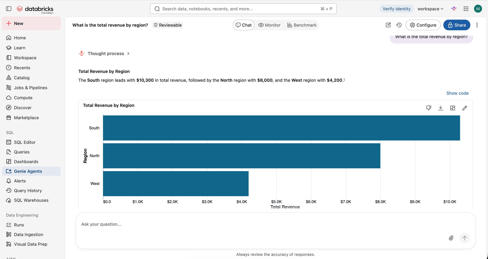
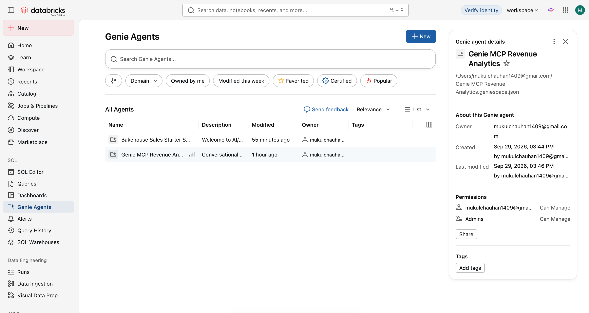
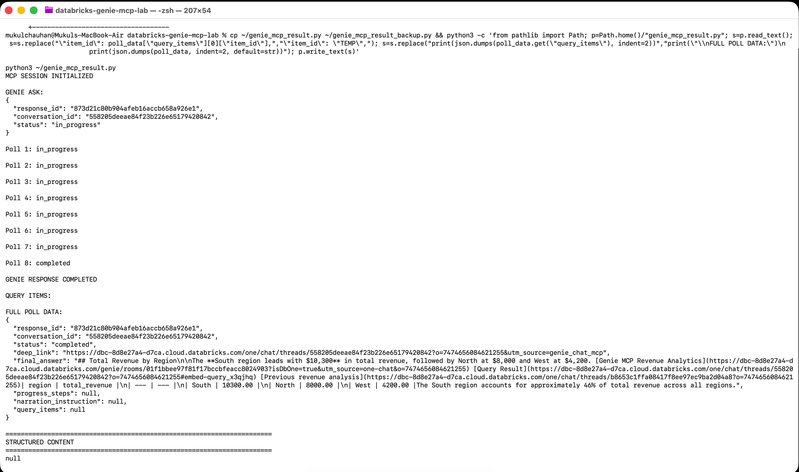

# Hands-on Validation: Genie One MCP

## Status

Hands-on validation: COMPLETE

Validation date: September 29, 2026

## Objective

Validate the end-to-end integration between a Python MCP client, Databricks Genie One MCP, Genie, and governed Unity Catalog data.

The objective was to confirm that natural-language business questions can be sent through MCP and that Genie can return analytical results from the configured data.

## Environment

- Databricks Free Edition workspace
- Databricks CLI 1.18.0
- Python 3.11.5
- MCP Python SDK 2.2.0
- Databricks Genie One
- Unity Catalog
- Genie One MCP service
- Python MCP client using Streamable HTTP

## Demo Data

Catalog:

`genie_mcp_demo`

Schema:

`analytics`

Tables:

- `genie_mcp_demo.analytics.customers`
- `genie_mcp_demo.analytics.orders`

### Customers

| customer_id | customer_name | region |
| --- | --- | --- |
| 101 | Customer A | North |
| 102 | Customer B | South |
| 103 | Customer C | West |

### Orders

| order_id | customer_id | order_date | amount |
| --- | --- | --- | ---: |
| 1001 | 101 | 2026-09-01 | 5000.00 |
| 1002 | 102 | 2026-09-02 | 7500.00 |
| 1003 | 101 | 2026-09-05 | 3000.00 |
| 1004 | 103 | 2026-09-07 | 4200.00 |
| 1005 | 102 | 2026-09-10 | 2800.00 |

## Genie Configuration

Genie Space:

`Genie MCP Revenue Analytics`

Business context defined:

- customers contains customer master information.
- customer_id uniquely identifies a customer.
- orders contains individual customer orders.
- order_id uniquely identifies an order.
- orders.customer_id joins to customers.customer_id.
- orders.amount represents revenue.
- Revenue is calculated as SUM(orders.amount).
- Revenue by region is calculated by joining orders to customers and grouping by customers.region.

## MCP Endpoint

The validation used the Databricks-provided Genie One MCP service:

`https://<workspace-hostname>/ai-gateway/mcp-services/system.ai.genie_one_mcp`

The MCP client authenticated using the existing Databricks CLI OAuth profile.

No access token was hardcoded in the source code.

## MCP Request Flow

The Python client performs the following sequence:

```text
Python MCP Client
        |
        | OAuth
        v
Databricks Authentication
        |
        v
system.ai.genie_one_mcp
        |
        | genie_ask
        v
Genie One
        |
        v
Genie MCP Revenue Analytics
        |
        v
Unity Catalog
        |
        +-- customers
        |
        +-- orders
        |
        v
Business Query
        |
        v
genie_poll_response
        |
        v
Completed Response
        |
        v
Python MCP Client
```

## Validation Results

### Test 1: Customer revenue

Question:

Which customer generated the most revenue?

Result:

- Customer B
- Revenue: $10,300
- Status: PASS

### Test 2: Top 3 orders

Question:

What are the top 3 orders by amount?

Result:

| Order | Amount |
| --- | ---: |
| 1002 | $7,500 |
| 1001 | $5,000 |
| 1004 | $4,200 |

Status: PASS

### Test 3: Revenue by region

Question:

What is the total revenue by region?

Result:

| Region | Total revenue |
| --- | ---: |
| South | $10,300 |
| North | $8,000 |
| West | $4,200 |
| Total | $22,500 |

Status: PASS

## Validation Summary

| Capability | Result |
| --- | --- |
| MCP session initialization | PASS |
| MCP tool discovery | PASS |
| genie_ask | PASS |
| genie_poll_response | PASS |
| Customer revenue analysis | PASS |
| Top-N order analysis | PASS |
| Revenue by region | PASS |
| Unity Catalog data access | PASS |
| End-to-end Genie One MCP flow | PASS |
| genie_get_query_result full-result retrieval | Not validated |

## genie_get_query_result Note

The completed MCP response returned the rendered analytical answer and Databricks deep links successfully.

During the Python MCP SDK test, the completed response exposed `query_items` as null. Because `genie_get_query_result` requires the query's `item_id`, the full-result retrieval path was not marked as successfully validated.

This is documented as a validation limitation rather than a failure of the core Genie One MCP request flow.

## Evidence

Screenshots captured during the hands-on validation include:

1. Genie analytical result showing total revenue by region.
2. Genie Agent configuration for `Genie MCP Revenue Analytics`.
3. Python MCP client showing `genie_ask`, polling, and completed response.

### Genie analytical result



### Genie Agent configuration



### Python MCP client validation



## Limitations

- Validation was performed against a small controlled dataset.
- The validation demonstrates functional behavior, not production-scale performance.
- Only a limited set of analytical question types was tested.
- `genie_get_query_result` was not marked as validated because the Python MCP SDK response exposed `query_items` as null for the completed response used in testing.
- Production deployments should be validated against the current Databricks documentation and workspace governance configuration.
